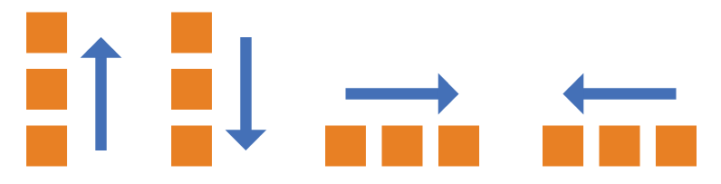
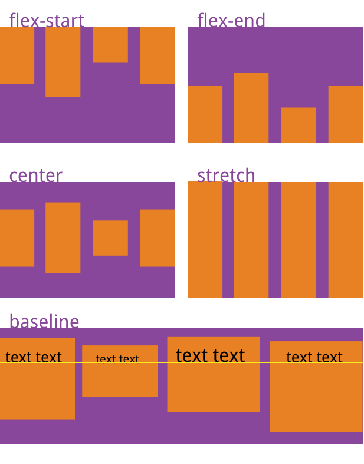
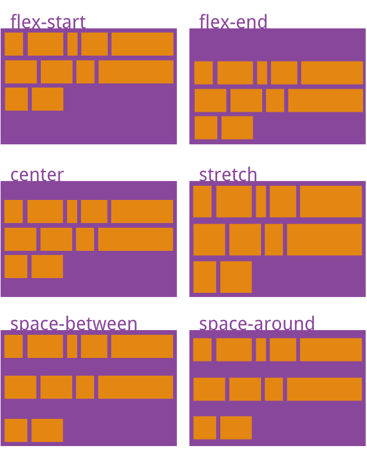
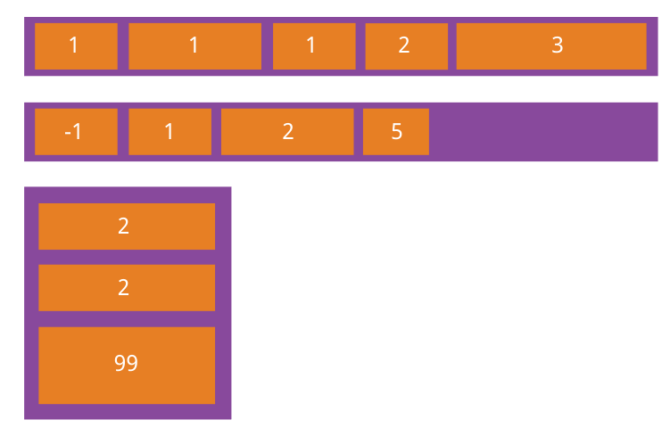
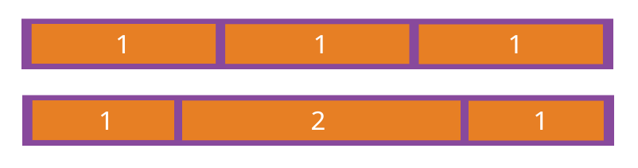

# flex

## table of contents

- [Introduction](#Introduction)

- [Container](#Container)

- [Item](#Item)

## Introduction

- 任何一个容器都可以指定为 Flex 布局。

  ```css
  .box {
    display: flex;
  }
  ```

- 行内元素也可以使用 Flex 布局。

  ```css
  .box {
    display: inline-flex;
  }
  ```

**注意，设为 Flex 布局以后，子元素的`float`、`clear`和`vertical-align`属性将失效。**

## Container

- 采用 Flex 布局的元素，称为 Flex 容器（flex container），简称"容器"。它的所有子元素自动成为容器成员，称为 Flex 项目（flex item），简称"项目"。

- 以下 6 个属性设置在容器上。

  1. [`flex-direction`](#flex-direction)

  2. [`flex-wrap`](#flex-wrap)

  3. [`flex-flow`](#flex-flow)

  4. [`justify-content`](#justify-content)

  5. [`align-items`](#align-items)

  6. [`align-content`](#align-content)

### flex-direction

- `flex-direction`属性决定主轴的方向（即项目的排列方向）。

  ```css
  .box {
    flex-direction: row | row-reverse | column | column-reverse;
  }
  ```

- 它可能有 4 个值。

  1. `row`（默认值）：主轴为水平方向，起点在左端。

  2. `row-reverse`：主轴为水平方向，起点在右端。

  3. `column`：主轴为垂直方向，起点在上沿。

  4. `column-reverse`：主轴为垂直方向，起点在下沿。



### flex-wrap

- 默认情况下，项目都排在一条线（又称"轴线"）上。`flex-wrap`属性定义，如果一条轴线排不下，如何换行。

  

  ```css
  .box {
    flex-wrap: nowrap | wrap | wrap-reverse;
  }
  ```

- 它可能取三个值。

  1. `nowrap`（默认）：不换行。

  

  2. `wrap`：换行，第一行在上方。

  

  3. `wrap-reverse`：换行，第一行在下方。

  

### flex-flow

- `flex-flow`属性是`flex-direction`属性和`flex-wrap`属性的简写形式，默认值为`row nowrap`。

  ```css
  .box {
    flex-flow: <flex-direction> || <flex-wrap>;
  }
  ```

### justify-content

- `justify-content`属性定义了项目在主轴上的对齐方式。

  ```css
  .box {
    justify-content: flex-start | flex-end | center | space-between |
      space-around;
  }
  ```

  

- 它可能取 5 个值，具体对齐方式与轴的方向有关。下面假设主轴为从左到右。

  1. `flex-start`（默认值）：左对齐

  2. `flex-end`：右对齐

  3. `center`： 居中

  4. `space-between`：两端对齐，项目之间的间隔都相等。

  5. `space-around`：每个项目两侧的间隔相等。所以，项目之间的间隔比项目与边框的间隔大一倍。

### align-items

- `align-items`属性定义项目在交叉轴上如何对齐。

  ```css
  .box {
    align-items: flex-start | flex-end | center | baseline | stretch;
  }
  ```

  

- 它可能取 5 个值。具体的对齐方式与交叉轴的方向有关，下面假设交叉轴从上到下。

  1. `flex-start`：交叉轴的起点对齐。

  2. `flex-end`：交叉轴的终点对齐。

  3. `center`：交叉轴的中点对齐。

  4. `baseline`: 项目的第一行文字的基线对齐。

  5. `stretch`（默认值）：如果项目未设置高度或设为 auto，将占满整个容器的高度。

### align-content

- `align-content`属性定义了多根轴线的对齐方式。如果项目只有一根轴线，该属性不起作用。

  ```css
  .box {
    align-content: flex-start | flex-end | center | space-between | space-around
      | stretch;
  }
  ```

  

- 该属性可能取 6 个值。

  1. `flex-start`：与交叉轴的起点对齐。

  2. `flex-end`：与交叉轴的终点对齐。

  3. `center`：与交叉轴的中点对齐。

  4. `space-between`：与交叉轴两端对齐，轴线之间的间隔平均分布。

  5. `space-around`：每根轴线两侧的间隔都相等。所以，轴线之间的间隔比轴线与边框的间隔大一倍。

  6. `stretch`（默认值）：轴线占满整个交叉轴。

## Item

以下 6 个属性设置在项目上。

1. [order](#order)

2. [flex-grow](#flex-grow)

3. [flex-shrink](#flex-shrink)

4. [flex-basis](#flex-basis)

5. [item flex](#item-flex)

6. [align-self](#align-self)

### order

- `order`属性定义项目的排列顺序。数值越小，排列越靠前，默认为 0。

  ```css
  .item {
    order: <integer>;
  }
  ```

  

### flex-grow

- `flex-grow`属性定义项目的放大比例，默认为`0`，即如果存在剩余空间，也不放大。

  ```css
  .item {
    flex-grow: <number>; /* default 0 */
  }
  ```

  

- 如果所有项目的`flex-grow`属性都为`1`，则它们将等分剩余空间（如果有的话）。如果一个项目的`flex-grow`属性为`2`，其他项目都为`1`，则前者占据的剩余空间将比其他项多一倍。

### flex-shrink

- `flex-shrink`属性定义了项目的缩小比例，默认为`1`，即如果空间不足，该项目将缩小。

  ```css
  .item {
    flex-shrink: <number>; /* default 1 */
  }
  ```

  

- 如果所有项目的`flex-shrink`属性都为`1`，当空间不足时，都将等比例缩小。如果一个项目的`flex-shrink`属性为`0`，其他项目都为`1`，则空间不足时，前者不缩小。

**负值对该属性无效。**

### flex-basis

- `flex-basis`属性定义了在分配多余空间之前，项目占据的主轴空间（main size）。浏览器根据这个属性，计算主轴是否有多余空间。它的默认值为`auto`，即项目的本来大小。

  ```css
  .item {
    flex-basis: <length> | auto; /* default auto */
  }
  ```

- 它可以设为跟`width`或`height`属性一样的值（比如 `350px`），则项目将占据固定空间。

### item flex

- `flex`属性是`flex-grow`, `flex-shrink` 和 `flex-basis`的简写，默认值为`0 1 auto`。后两个属性可选。

  ```css
  .item {
    flex: none | [ < "flex-grow" > < "flex-shrink" >? || < "flex-basis" > ];
  }
  ```

- 该属性有两个快捷值：`auto` (`1 1 auto`) 和 `none` (`0 0 auto`)。

- 建议优先使用这个属性，而不是单独写三个分离的属性，因为浏览器会推算相关值。

### align-self

- `align-self`属性允许单个项目有与其他项目不一样的对齐方式，可覆盖`align-items`属性。默认值为`auto`，表示继承父元素的`align-items`属性，如果没有父元素，则等同于`stretch`

  ```css
  .item {
    align-self: auto | flex-start | flex-end | center | baseline | stretch;
  }
  ```

  

- 该属性可能取 6 个值，除了 `auto`，其他都与 `align-items` 属性完全一致。
