> [Flex 布局教程：语法篇 - 阮一峰](http://www.ruanyifeng.com/blog/2015/07/flex-grammar.html)  
> [tailwindcss flex](https://tailwindcss.com/docs/flex)

## Introduction

- 任何一个容器都可以指定为 Flex 布局

  ```css
  .box {
    display: flex;
  }

  /* 行内元素也可以使用 Flex 布局 */
  .box {
    display: inline-flex;
  }
  ```

**注意：设为 Flex 布局以后，子元素的 `float`、`clear` 和 `vertical-align` 属性将失效。**

## Container

- 采用 Flex 布局的元素，称为 Flex 容器（flex container），简称“容器”。它的所有子元素自动成为容器成员，称为 Flex 项目（flex item），简称“项目”

- 以下 6 个属性设置在容器上

  1. `flex-direction`

  2. `flex-wrap`

  3. `flex-flow`

  4. `justify-content`

  5. `align-items`

  6. `align-content`

### flex-direction

- `flex-direction` 决定主轴的方向（即项目的排列方向）。

  ```css
  .box {
    flex-direction: row | row-reverse | column | column-reverse;
  }
  ```

- 它可能有 4 个值

  1. `row`（默认值）：主轴为水平方向，起点在左端 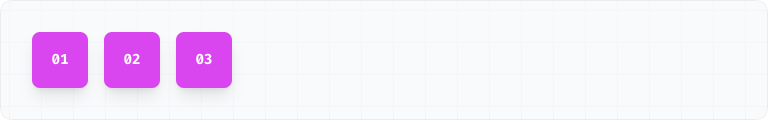

  2. `row-reverse`：主轴为水平方向，起点在右端 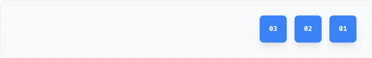

  3. `column`：主轴为垂直方向，起点在上沿 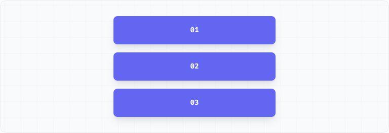

  4. `column-reverse`：主轴为垂直方向，起点在下沿 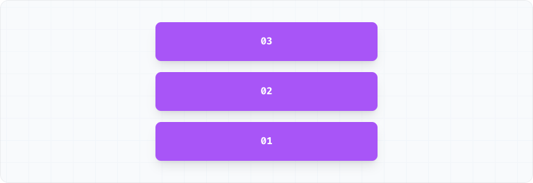

### flex-wrap

- 默认情况下，项目都排在一条线（又称"轴线"）上。`flex-wrap` 属性定义，如果一条轴线排不下，如何换行

  ```css
  .box {
    flex-wrap: nowrap | wrap | wrap-reverse;
  }
  ```

- 它可能取三个值

  1. `nowrap`（默认）：不换行 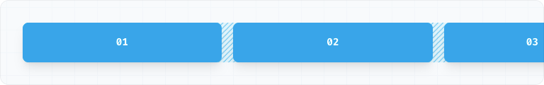

  2. `wrap`：换行，第一行在上方 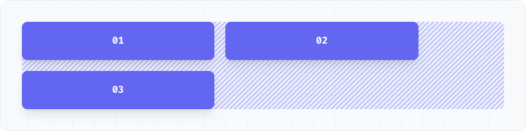

  3. `wrap-reverse`：换行，第一行在下方 

### flex-flow

- `flex-flow` 属性是 `flex-direction` 属性和 `flex-wrap` 属性的简写形式，默认值为 `row nowrap`

  ```css
  .box {
    flex-flow: <flex-direction> || <flex-wrap>;
  }
  ```

### justify-content

- `justify-content` 属性定义了项目在主轴上的对齐方式。

  ```css
  .box {
    justify-content: flex-start | flex-end | center | space-between |
      space-around ｜ space-evenly;
  }
  ```

- 它可能取 6 个值，具体对齐方式与轴的方向有关。下面假设主轴为从左到右

  1. `flex-start`（默认值）：左对齐 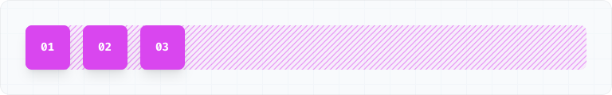

  2. `flex-end`：右对齐 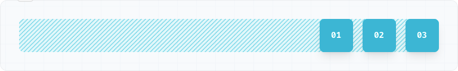

  3. `center`： 居中 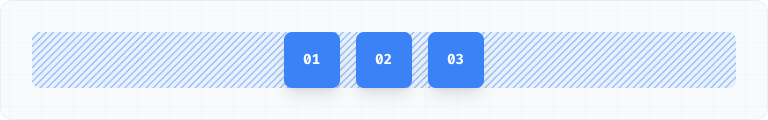

  4. `space-between`：两端对齐，项目之间的间隔都相等 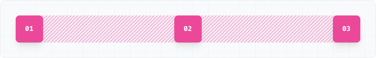

  5. `space-around`：每个项目两侧的间隔相等。所以，项目之间的间隔比项目与边框的间隔大一倍 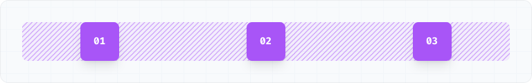

  6. `space-evenly`：每个项目周围有相等的空间 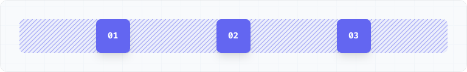

### align-items

- `align-items` 属性定义项目在交叉轴上如何对齐。

  ```css
  .box {
    align-items: flex-start | flex-end | center | baseline | stretch;
  }
  ```

- 它可能取 5 个值。具体的对齐方式与交叉轴的方向有关，下面假设交叉轴从上到下

  1. `flex-start`：交叉轴的起点对齐 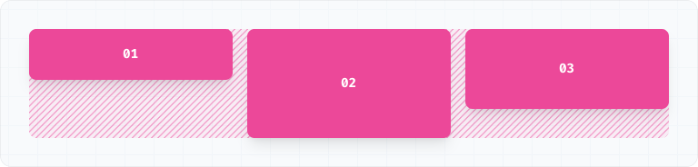

  2. `flex-end`：交叉轴的终点对齐 

  3. `center`：交叉轴的中点对齐 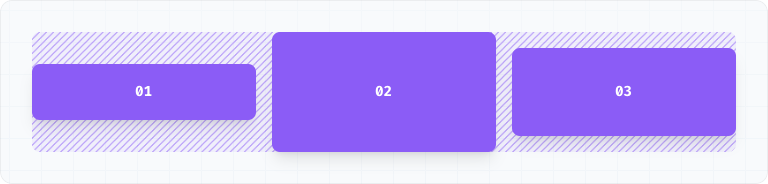

  4. `baseline`: 项目的第一行文字的基线对齐 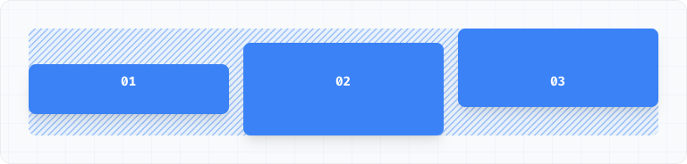

  5. `stretch`（默认值）：如果项目未设置高度或设为 auto，将占满整个容器的高度 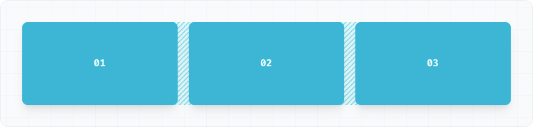

### align-content

- `align-content` 属性定义了多根轴线的对齐方式。该属性对单行弹性盒子模型无效。（即：带有 flex-wrap: nowrap）。

  ```css
  .box {
    align-content: flex-start | flex-end | center | space-between | space-around
      | space-evenly;
  }
  ```

- 该属性可能取 6 个值

  1. `flex-start`：与交叉轴的起点对齐 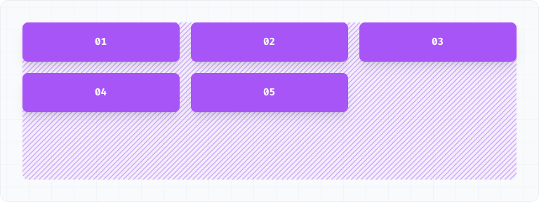

  2. `flex-end`：与交叉轴的终点对齐 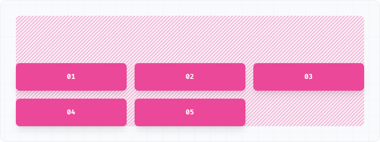

  3. `center`：与交叉轴的中点对齐 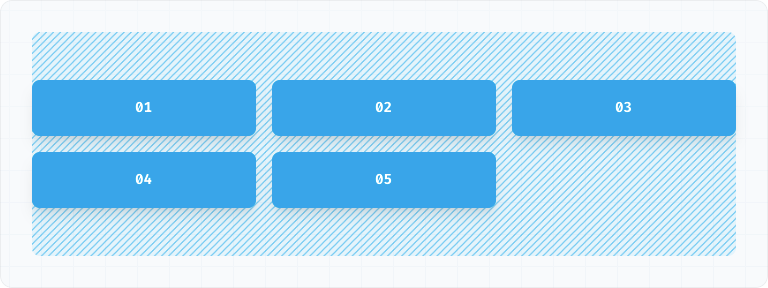

  4. `space-between`：与交叉轴两端对齐，轴线之间的间隔平均分布 

  5. `space-around`：每根轴线两侧的间隔都相等。所以，轴线之间的间隔比轴线与边框的间隔大一倍 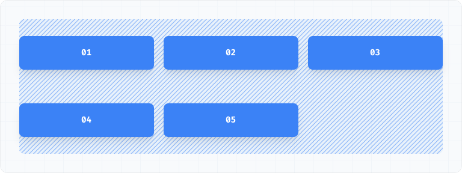

  6. `space-evenly`：每个项目周围的空间量相等 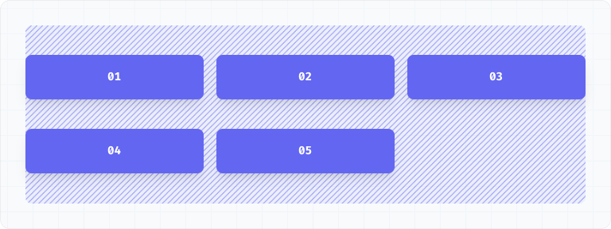

## Item

以下 6 个属性设置在项目上

1. `order`

2. `flex-grow`

3. `flex-shrink`

4. `flex-basis`

5. `item flex`

6. `align-self`

### order

- `order` 属性定义项目的排列顺序。数值越小，排列越靠前，默认为 0

  ```css
  .item {
    order: <integer>;
  }
  ```

- Example

  ```html
  <div class="flex justify-between ...">
    <div class="order-last">01</div>
    <div>02</div>
    <div>03</div>
  </div>
  ```

  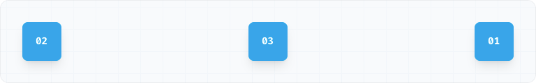

### flex-grow

- `flex-grow` 属性定义项目的放大比例，默认为 `0`，即如果存在剩余空间，也不放大

  ```css
  .item {
    flex-grow: <number>; /* default 0 */
  }
  ```

- example

  ```html
  <div class="flex ...">
    <div class="flex-none w-14 h-14 ...">01</div>
    <div class="grow h-14 ...">02</div>
    <div class="flex-none w-14 h-14 ...">03</div>
  </div>
  ```

  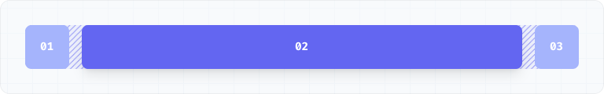

  ```html
  <div class="flex ...">
    <div class="grow h-14 ...">01</div>
    <div class="grow-0 h-14 ...">02</div>
    <div class="grow h-14 ...">03</div>
  </div>
  ```

  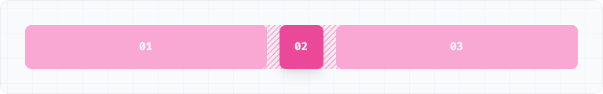

- 如果所有项目的 `flex-grow` 属性都为 `1`，则它们将等分剩余空间（如果有的话）。如果一个项目的 `flex-grow` 属性为 `2`，其他项目都为 `1`，则前者占据的剩余空间将比其他项多一倍

### flex-shrink

- `flex-shrink` 属性定义了项目的缩小比例，默认为 `1`，即如果空间不足，该项目将缩小

  ```css
  .item {
    flex-shrink: <number>; /* default 1 */
  }
  ```

- example

  ```html
  <div class="flex ...">
    <div class="flex-none w-14 h-14 ...">01</div>
    <div class="shrink w-64 h-14 ...">02</div>
    <div class="flex-none w-14 h-14 ...">03</div>
  </div>
  ```

  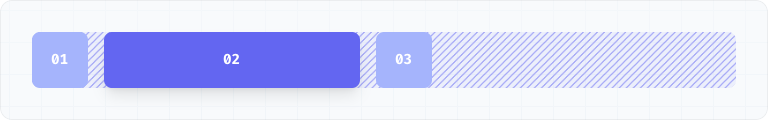

  ```html
  <div class="flex ...">
    <div class="flex-1 h-16 ...">01</div>
    <div class="shrink-0 h-16 w-32 ...">02</div>
    <div class="flex-1 h-16 ...">03</div>
  </div>
  ```

  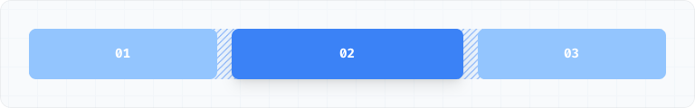

- 如果所有项目的 `flex-shrink` 属性都为 `1`，当空间不足时，都将等比例缩小。如果一个项目的 `flex-shrink` 属性为 `0`，其他项目都为 `1`，则空间不足时，前者不缩小。

**负值对该属性无效**

### flex-basis

- `flex-basis` 属性定义了在分配多余空间之前，项目占据的主轴空间（main size）。浏览器根据这个属性，计算主轴是否有多余空间。它的默认值为`auto`，即项目的本来大小

  ```css
  .item {
    flex-basis: <length> | auto; /* default auto */
  }
  ```

- example

  ```html
  <div class="flex flex-row">
    <div class="basis-1/4">01</div>
    <div class="basis-1/4">02</div>
    <div class="basis-1/2">03</div>
  </div>
  ```

  

- 它可以设为跟 `width` 或 `height` 属性一样的值（比如 `350px`），则项目将占据固定空间

### item flex

- `flex` 属性是 `flex-grow` , `flex-shrink` 和 `flex-basis` 的简写，默认值为`0 1 auto`。后两个属性可选

  ```css
  .item {
    flex: none | [ < 'flex-grow' > < 'flex-shrink' >? || < 'flex-basis' > ];
  }
  ```

- 该属性有两个快捷值：`auto` (`1 1 auto`) 和 `none` (`0 0 auto`)

- 建议优先使用这个属性，而不是单独写三个分离的属性，因为浏览器会推算相关值

### align-self

- `align-self` 属性允许单个项目有与其他项目不一样的对齐方式，可覆盖 `align-items` 属性。默认值为 `auto`，表示继承父元素的 `align-items` 属性，如果没有父元素，则等同于 `stretch`

  ```css
  .item {
    align-self: auto | flex-start | flex-end | center | baseline | stretch;
  }
  ```

  1. `auto`：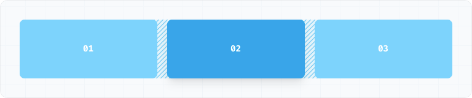

  2. `flex-start`：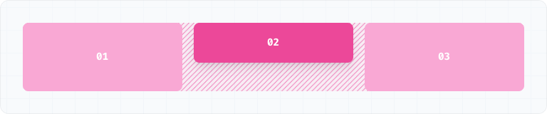

  3. `flex-end`：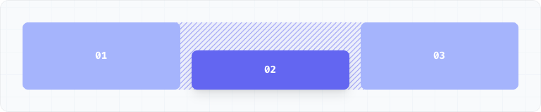

  4. `center`：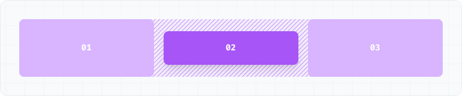

  5. `stretch`：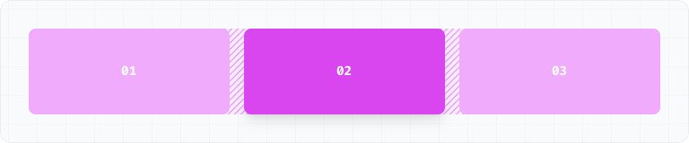

- 该属性可能取 6 个值，除了 `auto`，其他都与 `align-items` 属性完全一致。
